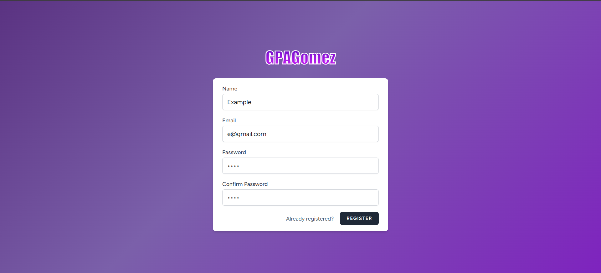
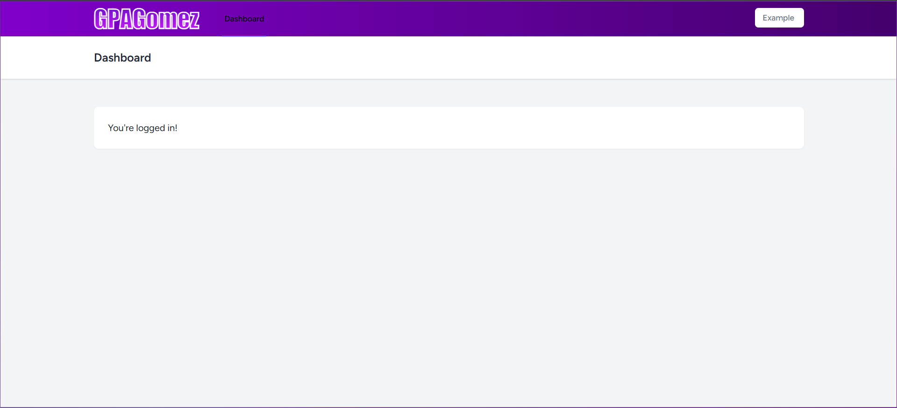
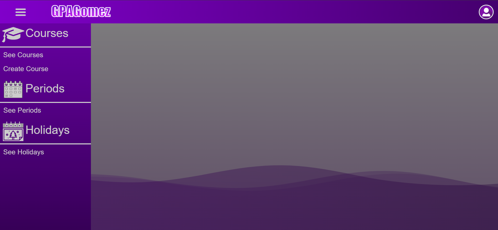
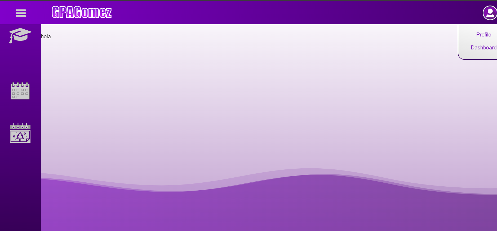
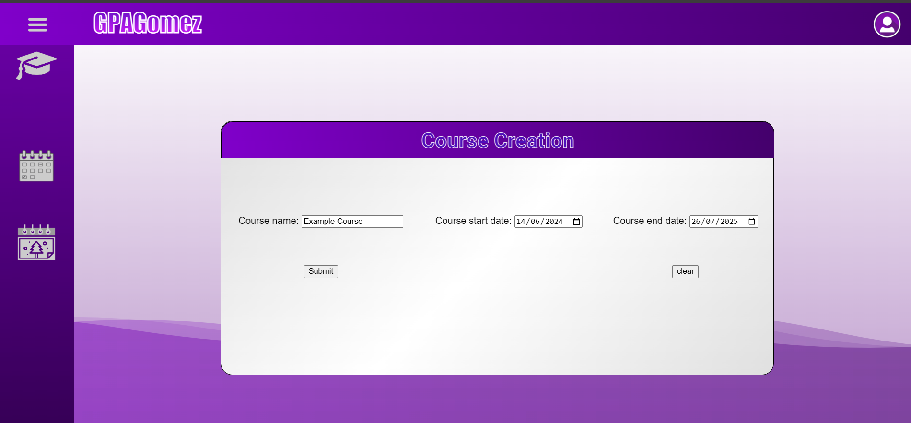
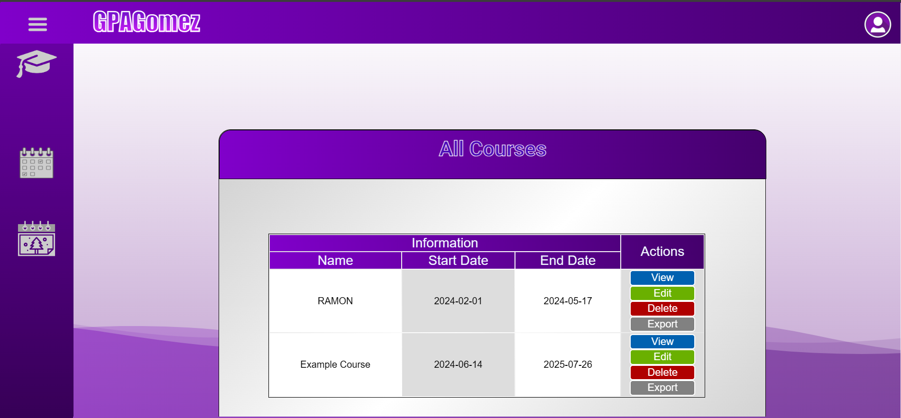
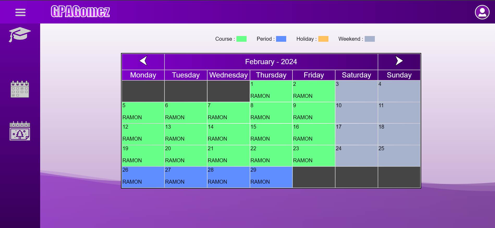

# PRACTICE-GPAGomez


This repository contains the GPA Gomez practice project, developed using PHP, Blade, CSS, and JavaScript.

## Features

- **PHP Backend**: Robust backend developed with PHP.
- **Blade Templating**: Dynamic views with Blade templating engine.
- **CSS Styling**: Modern and responsive design with CSS.
- **JavaScript Functionality**: Enhanced interactivity with JavaScript.

## Screenshoots

### Register



### Dashboard



### Lateral menu



### User Menu



### Course Creation



### All Courses Lists



### Autogenerated Calendar



## Installation

1. Clone the repository:
    ```bash
    git clone https://github.com/ReiselRol/PRACTICE-GPAGomez.git
    ```
2. Navigate to the project directory:
    ```bash
    cd PRACTICE-GPAGomez
    ```
3. Install dependencies:
    ```bash
    composer install
    npm install
    ```
4. Set up the environment:
    ```bash
    cp .env.example .env
    php artisan key:generate
    ```
5. Run the development server:
    ```bash
    php artisan serve
    npm run dev
    ```

## Usage

Access the application at `http://localhost:8000` and explore its features.

## Project Structure

- **app**: Core application files.
- **bootstrap**: Bootstrap files.
- **config**: Configuration files.
- **database**: Database migrations and seeders.
- **public**: Publicly accessible files.
- **resources**: Blade views and other frontend resources.
- **routes**: Application routes.
- **storage**: Storage files.
- **tests**: Unit and feature tests.

## Contributing

Contributions are welcome! Please open an issue or submit a pull request to discuss any changes you would like to make.

## License

This project is licensed under the MIT License. See the [LICENSE](LICENSE) file for more details.

## Contact

- **Author**: Ramon Rios
- **GitHub**: [ReiselRol](https://github.com/ReiselRol)
